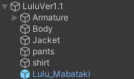

# 何ができるの？
・ルル君がまばたきできるようになります  
・AFKになるか、MMDをONにするとまばたきしなくなります  
・[なでなでシステム](https://github.com/Luke-514/Lulu_Nade)と互換性があります  
  
  
# 注意事項など
・対応アバターはらすちんワークス様の[ルル (Lulu)](https://aoikarasu.booth.pm/items/4271776)です  
・MMDボタンを削除している場合はまばたきしない可能性があります  
  
# 導入手順
1.&nbsp;[Modular Avatar](https://modular-avatar.nadena.dev/ja)をプロジェクトに追加します  
  
2.&nbsp;[Releases](https://github.com/Luke-514/Lulu_Mabataki/releases/latest)からLulu_Mabataki.unitypackageをダウンロードして、プロジェクトにインポートします  
  
3.&nbsp;Assets>Lulu_Mabatakiの中にある**Lulu_Mabataki.prefab**をアバター直下に追加します  
  
  
# 免責事項
本アセットの使用によって発生した、いかなる損害に対しても作者は一切の責任を負いません  
  
# 利用規約
本アセットの改変・二次配布を許可します  
(二次配布を行う際はクレジットに作者の名前を記載していただけると嬉しいです)  
  
# 作者
Luke514  
  
# Special Thanks
優希@白狼わんこ  

# 関連アセット
・[なでなでシステム](https://github.com/Luke-514/Lulu_Nade)  
・[尻尾振りシステム](https://github.com/Luke-514/Lulu_Tail_Move)  
  
# 寄付

